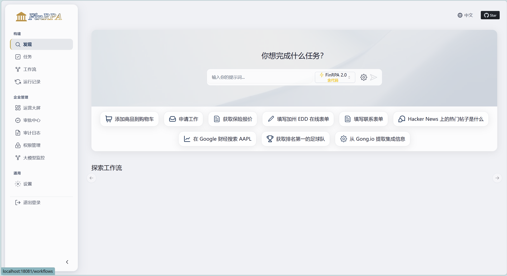
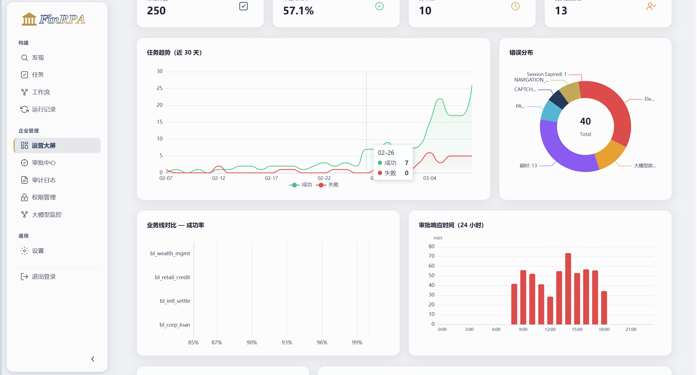
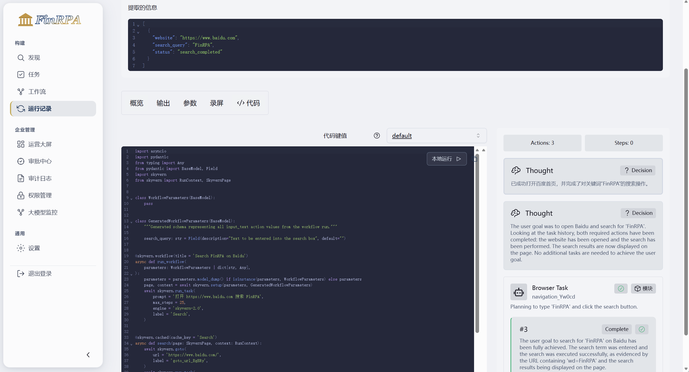
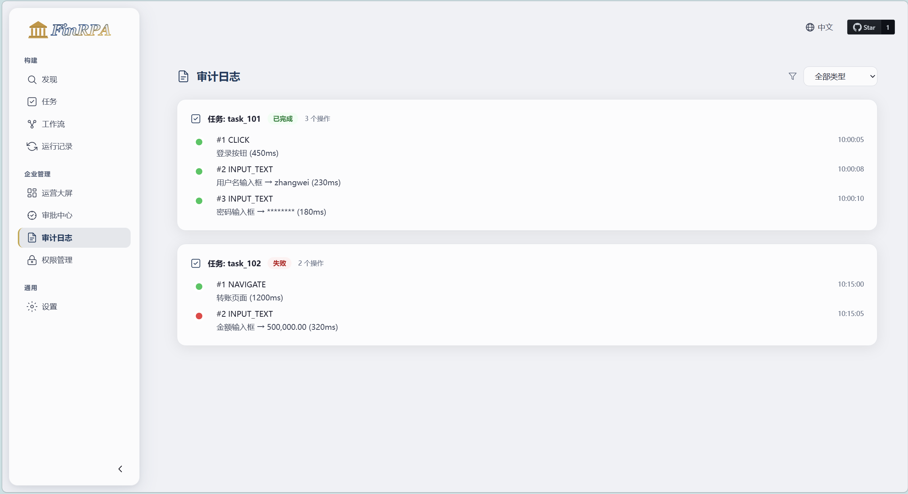
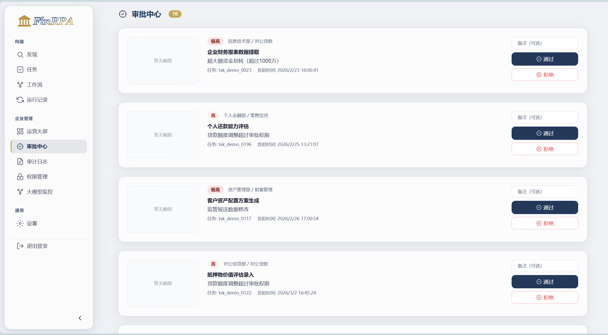

# FinRPA Enterprise
### 金融级 AI 浏览器自动化平台 · 银行 / 保险 / 证券场景深度定制

[](https://python.org)
[](https://fastapi.tiangolo.com)
[](LICENSE)
[](https://github.com/Skyvern-AI/skyvern)
[]()
[]()

---

## 这个项目是什么

基于 [Skyvern](https://github.com/Skyvern-AI/skyvern) 开源框架进行企业级二次开发，专门针对**金融行业**（银行、保险、证券）的真实业务场景进行深度定制。

Skyvern 用 LLM + 视觉理解来「读懂」页面，而不是依赖固定的 XPath 选择器，从根本上解决了传统 RPA 页面改版即失效的问题。本项目在这个基础上，补齐了企业落地必须具备的权限体系、合规审计、风险控制三项核心能力，并针对金融行业的组织结构特点做了深度适配。

---

## 为什么要做这个改造

Skyvern 原版是一个技术上很先进的底座，但它被设计为单机、单用户的场景。在一家银行或保险公司里，RPA 任务涉及对公信贷部、个人金融部、资产管理部等多个业务线，每条业务线有自己的操作员和审批员，风险管理部需要横跨所有业务线做监控，合规审计部需要能查到任何一条操作记录……这些企业真实的组织结构需求，原版完全没有考虑。

与此同时，金融监管对 RPA 的要求也比其他行业严格得多——所有自动化操作必须可追溯，高风险操作（转账、下单、核保）必须经过人工审批，数据不得传输到内网以外。这些合规要求不是「加个功能」就能满足的，需要在系统架构层面做好设计。

这个项目就是做这个「从技术产品到企业可用产品」的工程化工作。

---

## 核心改造内容

### 三维度权限体系

金融企业的组织结构是多维的，不能用简单的「角色」来描述权限边界。本项目设计了部门（Department）× 业务线（Business Line）× 角色（Role）三维度权限模型：

一个用户可以属于「对公信贷部」，同时参与「国际结算」业务线，持有「operator」角色，他能看到自己部门和关联业务线的所有任务，但看不到个人金融部的任务。风险管理部的人天然拥有跨部门只读权限，合规审计部的人拥有跨部门审批权限。operator 和 approver 在数据库层面强制互斥，同一人不能同时持有两个角色，对应金融机构的职责分离要求。整套权限矩阵通过 SQL 模拟数据脚本进行完整验证，覆盖所有边界场景。

### 高危操作分级审批

不是所有操作都需要人工确认，但金融场景里有一类操作绝对不能让 AI 自主执行——转账、放款、核保、下单。本项目构建了一套两阶段识别机制（关键词快速预筛 + LLM 精准判断），命中后根据风险等级（high/critical）路由给不同层级的审批人：high 级别找对应部门的审批员，critical 级别找合规审计部。整个等待过程通过 Redis Pub/Sub 实现，不阻塞其他任务，超时自动拒绝并告警。

### 全链路合规审计

每步 action 前后截图，上传到私有化 MinIO（满足数据不出内网的监管要求），配合操作类型、目标元素、操作人、时间戳、风险等级等元数据，构建完整操作时间线。输入的敏感信息（卡号、密码）在写入前自动脱敏。审计日志支持多维度检索，截图通过预签名 URL 临时访问。

### LLM 容错与 NEEDS_HUMAN 状态

LLM 不是 100% 可靠的，但 LLM 失败不应该等同于任务失败。本项目实现了三层容错（Prompt 强制格式约束 → Pydantic 校验重试 → 超出重试转 NEEDS_HUMAN），同时为 NEEDS_HUMAN 状态设计了完整的人工接管流程：查看卡住步骤的截图和 LLM 原始输出，选择跳过/手动执行/终止三种处置方式。

### Planner + Executor 双 Agent 协作

原始 Skyvern 是单一 Agent 循环执行，遇到复杂金融流程（跨多个页面、多个系统跳转）时，一旦中间某步失败，整个任务从头重来。本项目将「规划」和「执行」解耦为两个独立 Agent：Planner 接收导航目标，通过 LLM 拆解为有序子任务列表（每个子任务包含目标描述、完成条件、最大重试次数、失败策略）；Executor 逐步执行子任务并返回结构化结果；Coordinator 编排两者的通信，维护整体任务状态。

四种差异化失败策略：retry（瞬态错误重试）、skip（非关键步骤跳过）、abort（关键前置步骤失败终止）、replan（路径阻塞时请求 Planner 重新规划剩余步骤）。重规划次数超过上限（默认 3 次）后自动转入 NEEDS_HUMAN 状态。子任务状态通过 Pydantic 模型持久化，支持断点续跑——银行日终批处理中途中断后可从上一个成功子任务继续执行。

### 可组合 Skill 库

将「登录」「表单填写」「表格提取」等共用操作从自然语言导航目标中剥离，封装为 7 个独立的 Skill 类（统一接口：Pydantic 参数模型 + async execute + 错误策略 + 审计输出）：认证类（LoginSkill、SessionKeepAliveSkill）、交互类（FormFillSkill、SearchAndSelectSkill、PaginationSkill）、提取类（TableExtractSkill、FileDownloadSkill）。

6 个金融场景工作流模板通过 SkillStepDefinition 组合 Skill 序列，参数映射支持引用模式（从工作流参数取值）和字面量模式（模板预设值）。Pipeline 执行器按序执行 Skill 列表，每步独立处理错误策略，审计回调自动记录脱敏后的参数和执行结果。所有银行场景共享同一个 LoginSkill，登录页面变化时只需修改一处。

### Action 缓存与模型路由

相同页面结构的重复执行跳过 LLM 调用，直接复用缓存的决策结果。缓存 key 由 DOM 结构哈希（剥除动态内容）+ 导航目标哈希组成，TTL 24 小时。模型路由根据页面复杂度评分自动选择轻量/标准/重型模型，降低约 60% LLM 调用成本。

### 毛玻璃 UI 与 SVG 图标系统

原 Skyvern 前端界面经过完整视觉改造，统一为白色毛玻璃风格：白色半透明卡片、backdrop-filter 模糊效果、深海蓝+金色的主色调体系。全站图标替换为手工编写的 SVG 线描方案，stroke 而非 fill，不依赖任何图标库，风格统一可完全定制。新增企业专属页面：审批中心、审计日志、运营大屏、权限管理。

### 企业认证与全站国际化

完整的企业登录系统：支持机构下拉选择（动态 API 加载）、JWT 会话管理、路由守卫。企业 JWT 通过桥接函数无缝对接 Skyvern 原生认证，实现「从提示词创建工作流」等核心功能。全站 190+ 组件完成中英文国际化，一键切换语言。新增 LLM 监控面板，可视化展示模型弹性、成本分析、缓存命中率和人工接管队列。

---

## 界面预览

| 主界面 | 运营大屏 |
|:------:|:------:|
|  |  |

| 工作流编辑器 | 审计日志 |
|:------:|:------:|
|  |  |

| 审批中心 |
|:------:|
|  |

---

## 项目架构

```
finrpa-enterprise/
├── skyvern/                         # Skyvern 核心（最小改动原则）
├── enterprise/                      # 企业扩展层
│   ├── auth/                        # JWT 认证 + 三维度 RBAC
│   ├── tenant/                      # 多维度租户隔离中间件
│   ├── approval/                    # 风险识别 + 分级审批引擎
│   ├── audit/                       # 全链路审计 + 脱敏 + MinIO 存储
│   ├── dashboard/                   # 运营统计 API + Redis 缓存
│   ├── llm/                         # 三层容错 + Action 缓存 + 模型路由
│   ├── agent/                       # Planner + Executor 双 Agent 协作
│   ├── skills/                      # 7 个可组合 Skill（登录/表单/提取等）
│   ├── notification/                # 企业微信/钉钉通知
│   └── workflows/                   # 金融场景工作流模板（基于 Skill 组合）
├── skyvern-frontend/                # React 前端（毛玻璃风格改造）
│   ├── src/components/Icon/         # 手写 SVG 图标组件（21 个图标）
│   ├── src/components/enterprise/   # 企业通用组件
│   ├── src/routes/enterprise/       # 企业专属页面
│   └── src/styles/                  # CSS 设计 token + 毛玻璃样式
├── tests/
│   ├── unit/                        # 561 单元测试
│   ├── integration/                 # 40 端到端集成测试
│   └── fixtures/                    # SQL 模拟数据
├── nginx/                           # Nginx 反向代理配置
├── docker-compose.yml               # 开发环境（5 服务）
├── docker-compose.prod.yml          # 生产环境 overlay
├── Makefile                         # 常用操作入口
└── .env.example                     # 全量配置模板
```

---

## 技术栈

| 层次 | 技术 |
|------|------|
| AI Agent 底座 | Skyvern + Playwright |
| 后端框架 | FastAPI + Python 3.11 |
| ORM & 数据库 | SQLAlchemy 2.0 + PostgreSQL 14 |
| 缓存 & 消息 | Redis 7.x（Pub/Sub + 结果缓存） |
| 对象存储 | MinIO（私有化截图存储） |
| 认证授权 | JWT + 三维度 RBAC |
| 前端 | React 18 + TypeScript + ECharts + 手写 SVG 图标 |
| 容器化 | Docker Compose（开发 + 生产双配置） |
| 反向代理 | Nginx（gzip + 安全头 + HTTPS 预留） |
| 数据库迁移 | Alembic |
| 测试 | pytest + pytest-asyncio + Vitest + happy-dom |

---

## 快速启动

### 开发环境

```bash
git clone https://github.com/Hllqkb/finrpa-enterprise.git
cd finrpa-enterprise

cp .env.example .env
# 编辑 .env 填入 LLM API Key

make dev       # 一键启动所有服务（PostgreSQL + Redis + MinIO + Skyvern + UI）
make health    # 检查服务健康状态
make seed      # 导入演示数据
```

服务地址：

| 服务 | 地址 |
|------|------|
| 前端 Dev Server | http://localhost:28080 |
| Skyvern API | http://localhost:18000 |
| Skyvern UI (Docker) | http://localhost:18080 |
| MinIO 控制台 | http://localhost:19001 |
| MinIO API | http://localhost:19000 |
| PostgreSQL | localhost:15432 |
| Redis | localhost:16379 |

### 生产环境

```bash
# 生产模式启动（含 Nginx 反向代理、数据库调优、资源限制）
make dev-prod

# 或手动指定
docker compose -f docker-compose.yml -f docker-compose.prod.yml up -d
```

生产环境特性：
- Nginx 统一入口（80/443），API 和前端通过反向代理访问
- PostgreSQL 连接池调优（max_connections=200, shared_buffers=256MB）
- Redis RDB 持久化 + 512MB 内存限制
- 所有服务设置内存上限和 always 重启策略
- HTTPS 证书挂载预留（`nginx/certs/` 目录）

启用 HTTPS：
1. 将证书文件放入 `nginx/certs/`（`fullchain.pem` + `privkey.pem`）
2. 编辑 `nginx/conf.d/default.conf`，取消 SSL 相关注释
3. 重启 Nginx 容器

### 演示账号

**默认管理员账号**（容器启动自动创建，组织 ID：`锐智金融`）：

| 账号 | 密码 | 部门 | 角色 | 说明 |
|------|------|------|------|------|
| admin | admin | 管理部 | org_admin | 默认管理员 |

**演示数据账号**（`make seed` 后可用，组织 ID：`o_demo_cmb`）：

| 账号 | 密码 | 部门 | 角色 | 说明 |
|------|------|------|------|------|
| banking_admin | demo123 | 信息技术部 | super_admin | 平台管理员 |
| credit_operator | demo123 | 对公信贷部 | operator | 对公贷款业务线操作员 |
| credit_approver | demo123 | 对公信贷部 | approver | 审批员（与 operator 互斥） |
| risk_viewer | demo123 | 风险管理部 | viewer | 跨组织只读（cross_org_read） |
| compliance_approver | demo123 | 合规审计部 | approver | 全组织审批权（cross_org_approve） |

---

## 测试与质量保障

```bash
make test          # 运行全部测试
make test-unit     # 仅单元测试
make test-cov      # 覆盖率报告
make lint          # ruff + mypy 静态检查
```

当前指标：
- **601 个测试**全部通过（561 后端 + 40 端到端集成）
- **85% 代码覆盖率**（enterprise 包，目标 ≥ 70%）
- **37 个前端测试**通过（Icon、GlassCard、StatusBadge、RiskBadge、Timeline、ScreenshotDiff）

---

## Makefile 命令速查

| 命令 | 功能 |
|------|------|
| `make dev` | 开发模式启动 |
| `make dev-down` | 停止服务 |
| `make dev-prod` | 生产模式启动 |
| `make health` | 服务健康检查 |
| `make test` | 运行所有测试 |
| `make test-cov` | 覆盖率报告 |
| `make lint` | 代码静态检查 |
| `make migrate` | 数据库迁移 |
| `make seed` | 导入演示数据 |
| `make frontend-build` | 前端构建 |
| `make frontend-test` | 前端测试 |
| `make clean` | 清理 Docker 卷和缓存 |

---

## 开发进度

| 阶段 | 分支 | 核心内容 |
|------|------|---------|
| Day 1 | `day-1/project-setup` | 项目脚手架、Docker 环境 |
| Day 2 | `day-2/permission-data-model` | 三维度权限数据模型 + SQL 模拟数据 |
| Day 3 | `day-3/auth-and-permission` | JWT 认证 + 多维度权限验证 |
| Day 4 | `day-4/tenant-isolation-middleware` | 多维度租户隔离中间件 |
| Day 5 | `day-5/financial-risk-detector` | 金融场景高危操作识别引擎 |
| Day 6 | `day-6/approval-engine` | 分级审批引擎 + Redis Pub/Sub |
| Day 7 | `day-7/notification` | 企业微信/钉钉通知集成 |
| Day 8 | `day-8/audit-compliance` | 全链路审计 + MinIO 合规存储 |
| Day 9 | `day-9/llm-resilience` | LLM 三层容错 + NEEDS_HUMAN 状态机 |
| Day 10 | `day-10/financial-workflow-templates` | 六个金融场景工作流模板 + Skill 库 |
| Day 11 | `day-11/dashboard-api` | 运营统计后端 API + Redis 缓存 |
| Day 12 | `day-12/ui-redesign` | 毛玻璃 UI 改造 + SVG 图标系统 |
| Day 13 | `day-13/performance-optimization` | Action 缓存 + 模型路由优化 |
| Day 14 | `day-14/production-ready` | 容器化完善 + 端到端验收 |
| Day 15 | `day-15/enterprise-frontend-integration` | 企业认证 + 全站 i18n + LLM 监控 + SIT 测试 |
| Day 16 | `day-16/demo-data-integration` | 演示数据生成器 + 前后端字段对齐 + 运营大屏升级 |

每个阶段的设计决策和踩坑记录在对应分支的 `summaries/` 目录中。